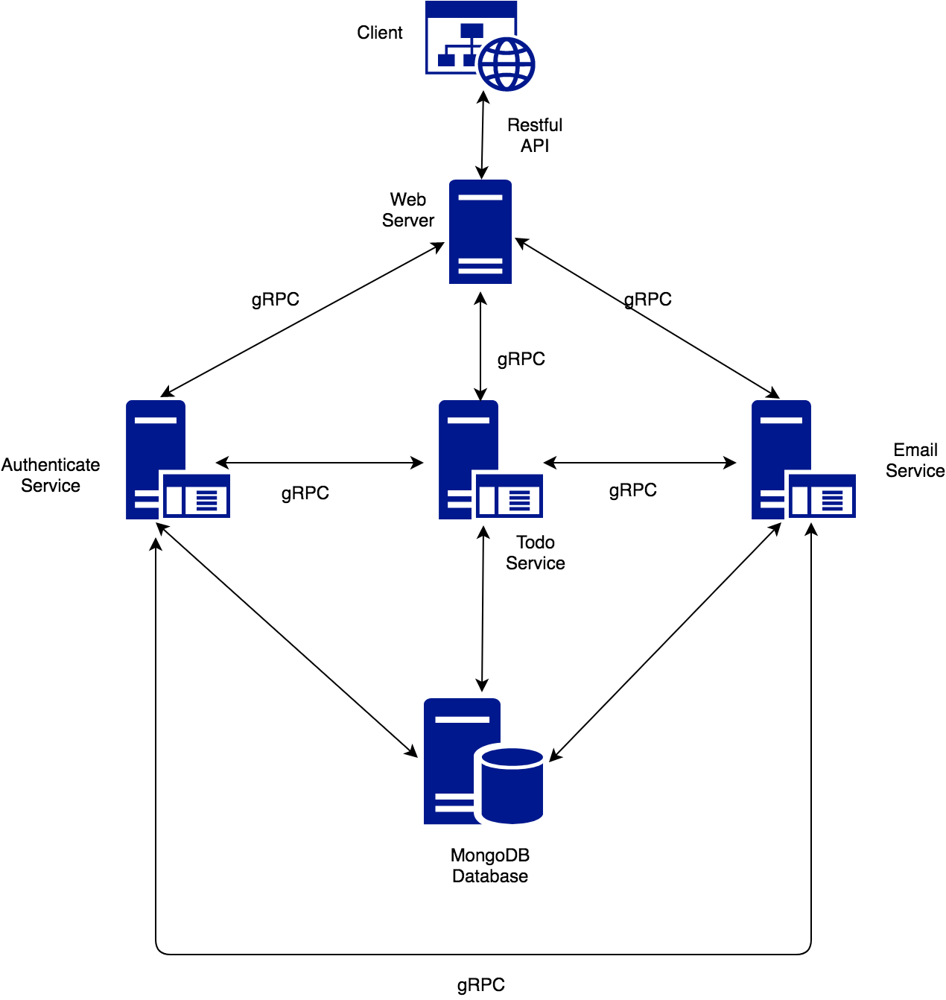

# NodeJS microservice using 

1. Architecture
       

2. Running
    ``` shell
    docker-compose pull
    docker-compose up
    ```

    Open http://localhost:3000 on your browser to test it
3. Contribute
    
    I haven't finish it yet, so, please help me to complete it with `change status` and `delete task` function and make a PR.

4. Authors

    - Phi-Hung Vo (@vophihungvn)